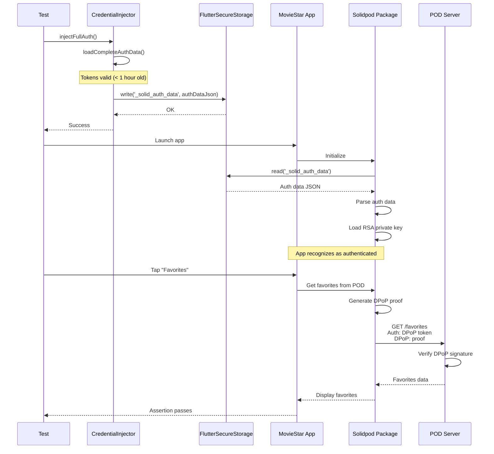
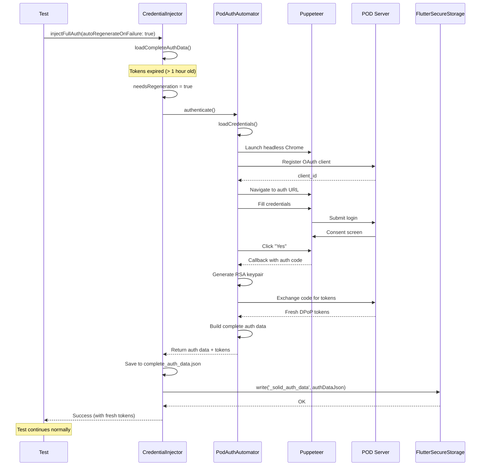

# Test Execution Flows

> This document describes the detailed execution flows for integration
> tests. For component overview, see [Architecture](architecture.md).
>
> **Documentation index:** See [README.md](../README.md) for complete
> documentation navigation.

## Test Execution Scenarios

Integration tests follow two main execution paths depending on token
validity:

+ **Scenario 1:** Fresh tokens (< 1 hour old) - Fast path
+ **Scenario 2:** Expired tokens with auto-regeneration - Full OAuth

## Scenario 1: Fresh Tokens (Happy Path)

When `complete_auth_data.json` contains valid tokens:



### Execution Steps

**Phase 1: Auth Injection (< 1 second)**

+ Load `complete_auth_data.json` from fixtures directory
+ Check token expiry timestamp against current time + 1 minute buffer
+ If valid, write JSON string to FlutterSecureStorage
+ Use key `_solid_auth_data` (contract with solidpod package)

**Phase 2: App Launch (2-5 seconds)**

+ Test calls `app.main()` to start MovieStar application
+ App initialization runs (providers, routes, theme)
+ Solidpod package checks FlutterSecureStorage for auth data
+ Finds injected data, parses JSON, loads RSA private key
+ App UI shows as authenticated (no login button)

**Phase 3: Test Assertions**

+ Test interacts with app widgets (tap, scroll, type)
+ App makes POD requests through solidpod package
+ Solidpod generates DPoP proof for each request
+ Signs proof with RSA private key from injected auth data
+ POD server verifies signature and returns data
+ Test assertions verify expected UI state

### Performance

| Step | Duration |
|------|----------|
| Load auth data | < 100ms |
| Check expiry | < 10ms |
| Write to storage | < 500ms |
| App launch | 2-5s |
| **Total** | **~3-6s** |

## Scenario 2: Expired Tokens with Auto-Regeneration

When tokens are expired and `autoRegenerateOnFailure: true`:



### Execution Steps

**Phase 1: Token Expiry Detection**

+ Load existing `complete_auth_data.json`
+ Parse `expires_at` timestamp from auth response
+ Compare with current time + 1 minute buffer
+ If expired, trigger regeneration flow

**Phase 2: Browser Automation (15-20 seconds)**

+ Call `PodAuthAutomator.authenticate()`
+ Load credentials from `test_credentials.json`
+ Launch headless Chrome via Puppeteer
+ Register dynamic OAuth client with POD server
+ Generate PKCE code verifier and challenge
+ Navigate to POD authorization URL
+ Fill login form (email, password, security key)
+ Submit form, wait for consent screen
+ Click consent button ("Yes")
+ Intercept OAuth callback on localhost:44007
+ Extract authorization code from callback URL

**Phase 3: Token Exchange**

+ Generate 2048-bit RSA keypair using pointycastle
+ Convert keys to JWK format for DPoP
+ Exchange authorization code for tokens
+ Request includes DPoP proof signed with new private key
+ POD returns access_token, id_token, expires_in
+ Build complete auth data structure

**Phase 4: Persistence**

+ Save complete auth data to `complete_auth_data.json`
+ Write to FlutterSecureStorage for app consumption
+ Return success to test

**Phase 5: Test Continues**

+ Test launches app (same as Scenario 1)
+ App finds fresh auth data in storage
+ Test assertions proceed normally

### Performance

| Step | Duration |
|------|----------|
| Detect expiry | < 100ms |
| Launch browser | 2-3s |
| OAuth flow | 10-15s |
| RSA generation | 1-2s |
| Token exchange | 1-2s |
| Save to disk | < 500ms |
| **Total** | **~15-25s** |

## Timing and Synchronization

### App Initialization Delays

Tests must wait for app to fully initialize:

```dart
app.main();
await tester.pumpAndSettle(const Duration(seconds: 5));
await Future.delayed(delay);  // 2s for styling to load
await tester.pump(interact);  // Visual inspection if needed
```

**Why each delay:**

+ `pumpAndSettle()` - Wait for animations and microtasks
+ `Future.delayed(delay)` - Allow theming/styling to apply
+ `tester.pump(interact)` - Optional visual review (0s in qtest)

### Storage Write Synchronization

FlutterSecureStorage writes are async but awaited:

```dart
await CredentialInjector.injectFullAuth();
// Auth data guaranteed written before app launch
app.main();
```

If not awaited, app might launch before auth data is written, causing
test to fail with "not logged in" state.

### Token Expiry Buffer

CredentialInjector uses 1-minute buffer for expiry checks:

```dart
final expiryTime =
  DateTime.fromMillisecondsSinceEpoch(expiresAt * 1000);
final bufferTime = DateTime.now().add(const Duration(minutes: 1));

if (expiryTime.isBefore(bufferTime)) {
  // Treat as expired, regenerate
}
```

**Why buffer:** Prevents race condition where tokens expire during
test execution.

## Error Handling

### Token Expiration During Test

**Symptom:**

```text
OpenIdException(invalid_grant): grant request is invalid
```

**Cause:** OAuth tokens expired mid-test (> 1 hour old)

**Handled by:**

+ `CredentialInjector._isTokenExpired()` checks timestamp before
  injection
+ If expired and `autoRegenerateOnFailure: true`, triggers
  regeneration
+ Fresh tokens automatically injected
+ Test continues without failure

**Manual recovery:**

```bash
dart run integration_test/tools/generate_auth_data.dart
```

### Browser Automation Failure

**Symptom:**

```text
TimeoutException: Waiting for login form timed out
```

**Cause:** POD server down, network issues, or incorrect selectors

**Handled by:**

+ `PodAuthAutomator` returns `AuthResult` with `success: false`
+ Error message describes failure point
+ Test fails with clear diagnostic message

**Recovery:**

+ Check POD server accessibility
+ Verify credentials in `test_credentials.json`
+ Run with `--no-headless` to debug selectors

### Missing Credentials File

**Symptom:**

```text
Exception: Test credentials file not found
```

**Cause:** `test_credentials.json` doesn't exist in fixtures directory

**Handled by:**

+ Exception thrown immediately with clear message
+ Test fails before browser launch
+ Prevents wasting time on doomed authentication attempt

**Recovery:**

Create credentials file:

```bash
mkdir -p integration_test/fixtures
cat > integration_test/fixtures/test_credentials.json <<EOF
{
  "email": "test@example.com",
  "password": "your-password",
  "securityKey": "1234",
  "issuer": "https://pods.example.com/"
}
EOF
```

## Performance Optimization

### Pre-Generate Tokens for Test Suites

Run before executing multiple tests:

```bash
dart run integration_test/tools/generate_auth_data.dart
make qtest  # All tests use pre-generated tokens
```

Avoids regeneration overhead for each test file.

### Disable Auto-Regeneration in CI

For CI/CD, pre-generate fresh tokens and disable auto-regeneration:

```yaml
- name: Generate auth data
  run: dart run integration_test/tools/generate_auth_data.dart

- name: Run tests
  run: |
    flutter test integration_test/test1.dart \
      -d linux --dart-define=AUTO_REGENERATE=false
```

Ensures consistent CI execution time (no random regeneration delays).

### Cache Considerations

**Not currently implemented:** Puppeteer browser instance caching

**Potential optimization:** Launch browser once, reuse for multiple
auth flows

**Complexity:** Browser state management, session cleanup between runs

## Security Flow

### Credential Lifecycle

```text
1. Test Credentials (test_credentials.json)
   └─> Git-ignored, contains real passwords
       └─> Read by PodAuthAutomator

2. OAuth Flow
   └─> Browser automation with real POD server
       └─> Returns authorization code

3. Token Exchange
   └─> Authorization code + RSA keys
       └─> Returns access_token, id_token

4. Complete Auth Data (complete_auth_data.json)
   └─> Git-ignored, contains tokens + private keys
       └─> Written to disk for reuse

5. FlutterSecureStorage
   └─> Platform-encrypted storage
       └─> App reads on launch

6. Cleanup
   └─> Tests clear storage after execution
       └─> Files remain on disk (manual deletion)
```

### Key Security Points

+ **Git-ignored files:** Credentials and tokens never committed
+ **Platform encryption:** FlutterSecureStorage uses OS-level
  encryption
+ **Dedicated test account:** Separate POD account for testing
+ **Token expiry:** Auto-regeneration prevents long-lived tokens
+ **CI secrets:** Encrypted storage of credentials in GitHub Actions

## See Also

+ [Architecture Overview](architecture.md) - Component diagrams
+ [Authentication Guide](authentication.md) - OAuth/DPoP concepts
+ [Testing Guide](../guides/testing-guide.md) - Running tests
+ [Troubleshooting](../guides/troubleshooting.md) - Common issues
