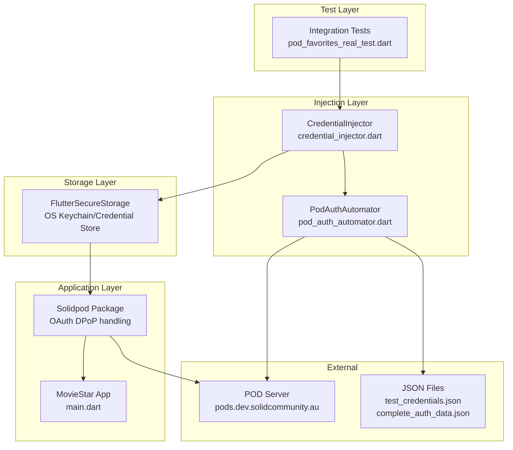

# Testing Architecture Overview

> This guide explains how the integration test components work together
> to enable authenticated POD testing.
>
> **For test execution flows:** See [Test Execution
> Flows](architecture-flows.md)
>
> **Documentation index:** See [README.md](../README.md) for complete
> documentation navigation.

## Component Overview

The testing framework consists of four main layers:



## Component Responsibilities

### Integration Tests

**Files:** `integration_test/workflows/pod_favorites_real_test.dart`

**Purpose:** End-to-end tests that verify POD operations work
correctly.

**Key responsibilities:**

+ Launch MovieStar app in test environment
+ Call `CredentialInjector.injectFullAuth()` before app starts
+ Verify app detects authenticated state
+ Test POD data operations (read/write favorites)
+ Clean up credentials after tests

**Code example:**

```dart
setUpAll() async {
  await CredentialInjector.injectFullAuth(
    autoRegenerateOnFailure: true,
  );
}

testWidgets('can access POD data', (tester) async {
  app.main();
  await tester.pumpAndSettle();

  // App should detect injected credentials
  expect(find.text('Logged in'), findsOneWidget);
});
```

### CredentialInjector

**File:** `integration_test/helpers/credential_injector.dart`

**Purpose:** Bridge between test environment and app's secure storage.

**Key responsibilities:**

+ Load `complete_auth_data.json`
+ Check if tokens are expired
+ Auto-regenerate tokens if enabled and expired
+ Inject complete auth data into `FlutterSecureStorage` under key
  `_solid_auth_data`
+ Clear credentials for test cleanup

**Data flow:**

```text
complete_auth_data.json
  → CredentialInjector
  → FlutterSecureStorage
  → solidpod package
  → MovieStar app
```

**Key methods:**

+ `loadCompleteAuthData()` - Reads JSON file
+ `injectCompleteAuthData()` - Writes to secure storage
+ `injectFullAuth()` - Main entry point with auto-regeneration
+ `clearCredentials()` - Test cleanup

### PodAuthAutomator

**File:** `integration_test/helpers/pod_auth_automator.dart`

**Purpose:** Puppeteer-based browser automation for OAuth flow.

**Key responsibilities:**

+ Launch headless Chrome browser
+ Register OAuth client with POD server
+ Generate PKCE code verifier and challenge
+ Navigate to POD login page
+ Fill email, password, security key
+ Handle consent screen
+ Intercept OAuth callback (authorization code)
+ Generate RSA keypair for DPoP
+ Exchange authorization code for DPoP-bound tokens
+ Return complete auth data structure

**Dependencies:**

+ `puppeteer` - Browser automation
+ `pointycastle` - RSA key generation
+ `http` - OAuth token exchange
+ `test_credentials.json` - User credentials

### FlutterSecureStorage

**Package:** `flutter_secure_storage`

**Purpose:** Platform-specific encrypted storage for sensitive data.

**Platform implementations:**

+ **iOS:** Keychain (KeychainAccessibility.first_unlock)
+ **Android:** EncryptedSharedPreferences (AES encryption)
+ **Windows:** Credential Manager
+ **Linux:** libsecret (Secret Service API)
+ **macOS:** Keychain (non-synchronizable)

**Key used by solidpod:**

```dart
const _authDataSecureStorageKey = '_solid_auth_data';
```

**Data stored:**

+ Complete auth data JSON string
+ Includes RSA keys, OAuth tokens, client metadata

### Solidpod Package

**Package:** `solidpod`

**Purpose:** Solid POD client library for Flutter.

**Key responsibilities:**

+ Read auth data from FlutterSecureStorage on app launch
+ Generate DPoP proofs for each API request
+ Sign proofs using RSA private key from auth data
+ Make authenticated requests to POD server
+ Handle token refresh (if refresh_token available)

**Integration point with tests:**

```dart
// App startup checks for injected auth data
final authData = await storage.read(key: '_solid_auth_data');
if (authData != null) {
  // App recognizes as logged in
}
```

## Directory Structure

```text
integration_test/
├── docs/                          # Documentation
│   ├── README.md                  # Overview and navigation
│   ├── authentication.md          # OAuth/DPoP concepts
│   ├── architecture.md            # This file
│   ├── architecture-flows.md      # Test execution flows
│   ├── json-files.md              # JSON structure reference
│   ├── adapting.md                # Reusability guide
│   ├── adapting-providers.md      # Provider compatibility
│   ├── adapting-cicd.md           # CI/CD integration
│   ├── testing-guide.md           # Operational guide
│   ├── testing-troubleshooting.md # Common issues
│   └── setup-guide.md             # Setup instructions
│
├── fixtures/                      # Test data (git-ignored)
│   ├── test_credentials.json      # POD account credentials
│   └── complete_auth_data.json    # OAuth tokens + RSA keys
│
├── helpers/                       # Test utilities
│   ├── credential_injector.dart   # Inject auth to storage
│   └── pod_auth_automator.dart    # Puppeteer automation
│
├── tools/                         # Standalone scripts
│   └── generate_auth_data.dart    # CLI tool to regenerate
│
├── utils/                         # Test configuration
│   └── delays.dart                # INTERACT delay constants
│
├── workflows/                     # E2E test scenarios
│   ├── pod_favorites_real_test.dart  # POD operations test
│   └── visual_login_test.dart        # Manual visual testing
│
├── app_test.dart                  # Basic smoke test
└── app_hive_test.dart             # Hive storage test
```

## Integration Points

### App Launch Detection

The MovieStar app detects injected credentials on startup:

**Location:** `lib/main.dart` or authentication provider

```dart
// Simplified example
Future<void> checkAuthStatus() async {
  final storage = FlutterSecureStorage();
  final authData = await storage.read(key: '_solid_auth_data');

  if (authData != null) {
    // Parse and use auth data
    final data = jsonDecode(authData);
    final webId = data['web_id'];
    // App shows as logged in
  }
}
```

### Secure Storage Key Contract

Both CredentialInjector and solidpod package must use the same
storage key:

```dart
// integration_test/helpers/credential_injector.dart
static const _authDataSecureStorageKey = '_solid_auth_data';

// solidpod package (internal)
const AUTH_DATA_KEY = '_solid_auth_data';
```

**Breaking this contract:** If keys mismatch, injected auth data won't
be found by the app.

### JSON Structure Contract

`complete_auth_data.json` must match the structure solidpod expects:

```json
{
  "web_id": "...",
  "rsa_info": {
    "private_key_jwk": {...},
    "public_key_jwk": {...}
  },
  "auth_response": {
    "token": {...},
    "credential": {...}
  }
}
```

**Breaking this contract:** If structure changes, solidpod won't parse
auth data correctly.

See [JSON Files Reference](../reference/json-files.md) for complete structure
documentation.

## Timing and Synchronization

### App Initialization

Tests must wait for app to fully initialize before making assertions:

```dart
app.main();
await tester.pumpAndSettle(const Duration(seconds: 5));
await Future.delayed(delay);  // Allow styling to load
await tester.pump(interact);  // Visual inspection delay
```

### Storage Write Delays

FlutterSecureStorage writes are asynchronous. Tests must await
injection:

```dart
await CredentialInjector.injectFullAuth();
// Auth data guaranteed written before app launch
app.main();
```

### Token Expiry Buffer

CredentialInjector checks token expiry with 1-minute buffer:

```dart
final expiryTime =
  DateTime.fromMillisecondsSinceEpoch(expiresAt * 1000);
final bufferTime = DateTime.now().add(const Duration(minutes: 1));

if (expiryTime.isBefore(bufferTime)) {
  // Treat as expired
}
```

This prevents race conditions where tokens expire mid-test.

## Security Architecture

### Credential Isolation

```text
Development Machine:
├── test_credentials.json (git-ignored)
│   └── Never committed to repository
│
├── complete_auth_data.json (git-ignored)
│   └── Regenerated hourly, contains private keys
│
└── FlutterSecureStorage (OS-level encryption)
    └── Encrypted by platform, cleared after tests
```

### CI/CD Considerations

For CI environments:

+ **Encrypted secrets** - Store `test_credentials.json` in GitHub
  Secrets
+ **Pre-generated tokens** - Check in encrypted
  `complete_auth_data.json`
+ **Dedicated test POD** - Use separate POD account for CI
+ **Token rotation** - Regenerate CI tokens weekly

See [CI/CD Integration](../guides/adapting-cicd.md) for CI setup details.

## See Also

+ [Test Execution Flows](architecture-flows.md) - Detailed execution
  diagrams
+ [JSON Files Reference](../reference/json-files.md) - Detailed file structure
  documentation
+ [Adapting for Your App](../guides/adapting.md) - Reusability guide
+ [Testing Guide](../guides/testing-guide.md) - Run tests and troubleshoot
+ [Authentication Guide](authentication.md) - OAuth/DPoP concepts
